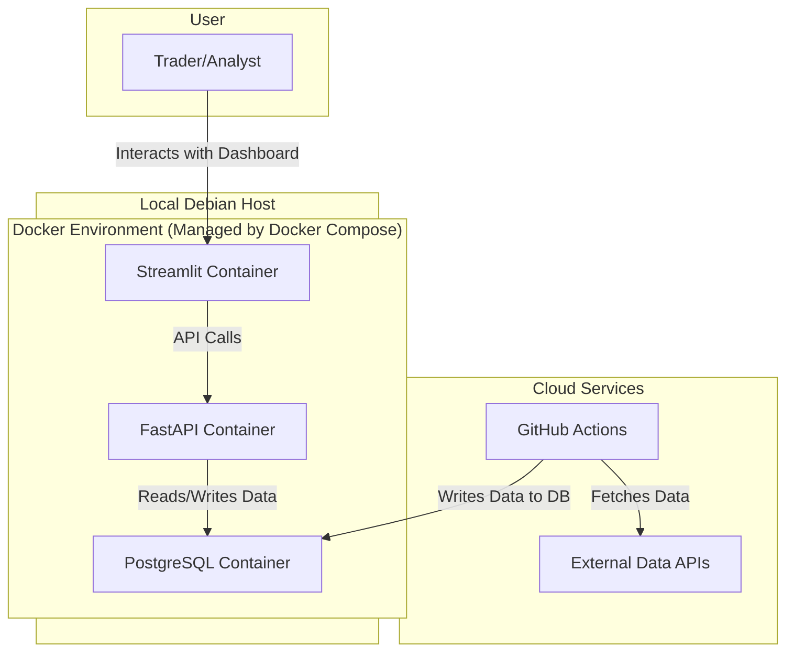

# 1. System Architecture

This document outlines the architecture for the FCM Trader application, a decision-support and portfolio tracking tool designed to generate trade signals and help users manage their manually executed trades. The architecture is modular, scalable, maintainable, and follows a 3-tier system design and a feature-centric development approach.

---

## 2. Architectural Approach

### 2.1. 3-Tier System

The application is structured into three logical tiers to separate concerns and enhance scalability:

1.  **Presentation Tier (Frontend)**: A user-facing interface for visualizing data, signals, and performance.
2.  **Application Tier (Backend)**: The core logic of the system, responsible for data processing, signal generation, and portfolio management. It exposes a RESTful API for the frontend to consume.
3.  **Data Tier**: Manages the storage and retrieval of all data, including market data, signals, and trade records, primarily using managed cloud services.

### 2.2. Feature-Centric Design

The codebase will be organized by feature to promote modularity and parallel development. Each feature (e.g., `data_ingestion`, `signal_generation`, `portfolio_management`) will be a self-contained module with its own logic, models, and services.

### 2.3. Architectural Patterns

-   **3-Tier Architecture:** Separation of concerns into Presentation, Application, and Data tiers for independent development and scaling.
-   **Feature-Centric (Vertical Slice) Architecture:** Organizing code by feature rather than by technical layer to improve modularity and align with development workflow.
-   **Repository Pattern:** Abstracting data access logic from business logic to enhance testability and flexibility.
-   **API Gateway Pattern:** Using a single entry point for all API calls to centralize cross-cutting concerns like authentication, logging, and rate limiting.

---

## 3. Technology Stack

The technology stack for the MVP is chosen for cost efficiency, local development, and cloud readiness.

| Category | Technology | Version | Purpose |
| :--- | :--- | :--- | :--- |
| **Frontend** | Streamlit | ~1.33 | Rapid development of data-centric dashboards. |
| **Backend** | FastAPI | ~0.110 | High-performance, asynchronous RESTful API. |
| **Database** | PostgreSQL | 13 | Primary relational database for persistent data. |
| **Batch Jobs** | GitHub Actions | v2 | Free, scheduled execution of data and signal tasks. |
| **Deployment** | Docker & Docker Compose | ~24.0 | Containerization for local environment orchestration. |
| **Host OS** | Linux (Debian) | N/A | Local machine for running Docker containers. |
| **Logging** | Structlog | ~24.1 | Structured logging for better observability. |
| **Testing** | Pytest | ~8.1 | Unit and integration testing for the backend. |

---

## 4. Component Design & Data Flow

The MVP system is composed of containerized services running locally, with batch processes offloaded to GitHub Actions.



### 4.1. Data Ingestion & Signal Generation (GitHub Actions)

-   **Responsibility**: Fetches market data and generates trading signals on a schedule.
-   **Logic**: A GitHub Actions workflow triggers Python scripts that run in a containerized environment. These scripts fetch data from external APIs, clean and validate it, store it in the PostgreSQL database, and then generate trading signals based on the stored data.

### 4.2. Portfolio Service (FastAPI)

-   **Responsibility**: Manages the user's portfolio of trades based on manual input.
-   **Logic**: Provides API endpoints for the user to perform Create, Read, Update, and Delete (CRUD) operations on their trade positions.

---

## 5. Core Data Entities

The system revolves around four primary data models.

-   **Instrument**: Represents a tradable asset (e.g., "SPY", "EURUSD").
    -   *Key Attributes*: `symbol`, `name`, `asset_class`.
-   **MarketData**: Stores the historical OHLCV data for each instrument.
    -   *Key Attributes*: `instrument_id`, `date`, `open`, `high`, `low`, `close`, `volume`.
-   **Signal**: Records the trading signals generated by the strategy.
    -   *Key Attributes*: `instrument_id`, `date`, `signal_type`, `reason`.
-   **Position**: Represents a trade position manually entered and managed by the user.
    -   *Key Attributes*: `instrument_id`, `entry_date`, `exit_date`, `entry_price`, `exit_price`, `size`, `direction`, `status`.

---

## 6. Project Structure (Feature-Centric)

The project will be organized as follows to reflect the feature-centric approach:

```
fcm-trader/
├── app/
│   ├── main.py                 # FastAPI application entry point
│   ├── core/                   # Core configuration, settings
│   ├── features/
│   │   ├── data_ingestion/
│   │   │   ├── __init__.py
│   │   │   ├── service.py
│   │   │   └── models.py
│   │   ├── signal_generation/
│   │   │   └── ...
│   │   └── ...
│   ├── models/                 # Shared SQLAlchemy/SQLModel base models
│   └── services/               # Shared utility services
├── scripts/                    # Standalone scripts
├── tests/                      # Tests, mirroring the app structure
│   └── features/
│       └── ...
├── .env                        # Environment variables
├── docker-compose.yml          # Docker orchestration
└── pyproject.toml              # Project dependencies
