# Document Control

IMPORTANT: Always confirm with user that it is up-to-date, else ask user to update immediately !

This CTRL file tracks the status and dependencies of key project documents.

`Work_Copy` is the file copy used for editing. When it's content are finalized, a `Baseline_Copy` is created with an incremental number eg. `_v{{int}}`.

MUST Adhering to the `Document Dependency Flow`, a change in any document may trigger a review and update to it's respective downstream document(s).

## Document Status

| Baseline_Copy                | Work_Copy                 | Remarks                                                                              |
|------------------------------|---------------------------|--------------------------------------------------------------------------------------|
| `docs/specs_v2.md`           | `docs/specs.md`           | Updated based on user input.                                                         |
| `docs/prd_v2.md`             | `docs/prd.md`             | Updated based on baselined `specs`.                                                  |
| `docs/architecture_v3.md`    | `docs/architecture.md`    | Updated based on baselined `prd`.                                                    |
| `docs/detailed_design_v2.md` | `docs/detailed_design.md` | Updated based on baselined `architecture`.                                           |
| `task_v3.md`                 | `task.md`                 | Updated based on baselined `detailed_design` to track progress of all implementation |
| `ctrl.md`                    | `ctrl.md`                 | This document; to manage document controls, dependency and status.                   |

NOTE: The latest version of the document is usually named with a `postfix`: `_v{{number}}` with the highest {{number}}.

## Document Dependency Flow

This diagram illustrates how changes in one document typically influence others. The flow originates from the initial task, moves through requirements and specifications, and culminates in the architectural design.

```mermaid
graph TD
    C[docs/specs];
    B[docs/prd];
    D[docs/architecture];
    E[docs/detailed_design];
    F["implementations<br>(scripts, code, tests, ...etc)"];
    C --> B;
    A[docs/task.md];
    B --> D;
    D --> E;
    E --> A;
    A --> F;
    style A fill:#000,stroke:#333,stroke-width:2px
    style B fill:#000,stroke:#333,stroke-width:2px
    style C fill:#000,stroke:#333,stroke-width:2px
    style D fill:#000,stroke:#333,stroke-width:2px
    style E fill:#000,stroke:#333,stroke-width:2px
    style F fill:#000,stroke:#333,stroke-width:2px
```

