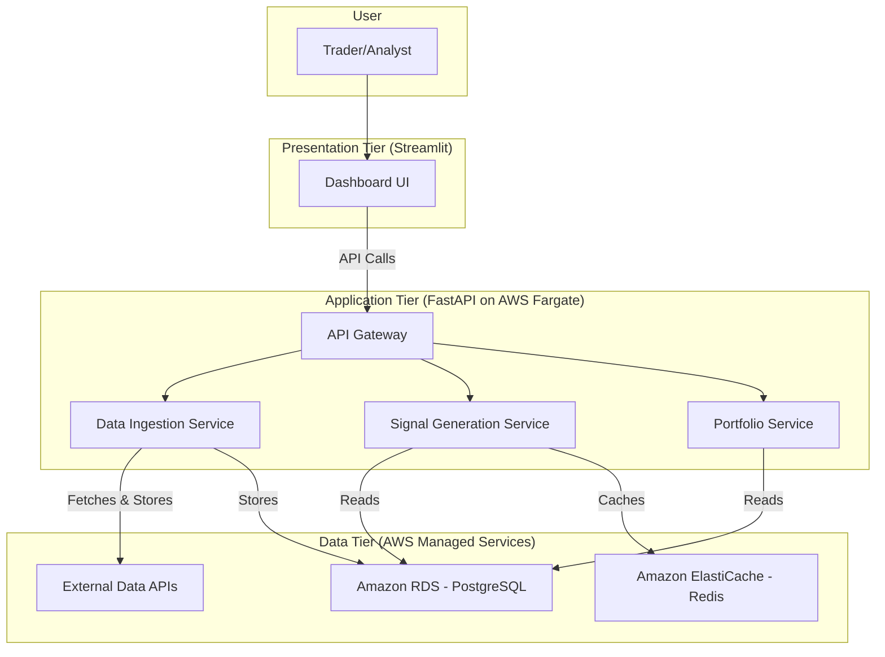
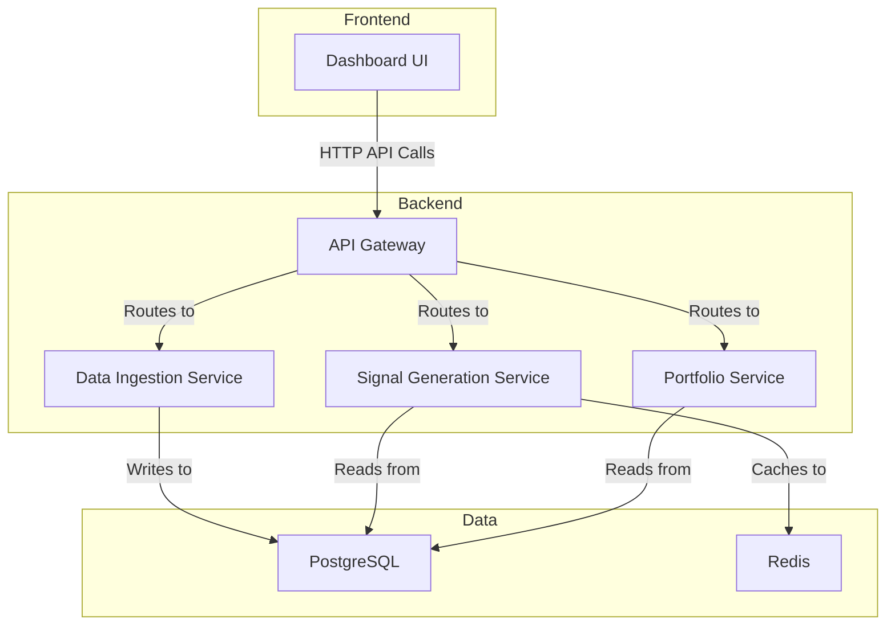

# 1. Introduction

This document outlines the complete fullstack architecture for the FCM Trader project, including backend systems, frontend implementation, and their integration. It serves as the single source of truth for AI-driven development, ensuring consistency across the entire technology stack.

This unified approach combines what would traditionally be separate backend and frontend architecture documents, streamlining the development process for modern fullstack applications where these concerns are increasingly intertwined.

## 1.1. Starter Template or Existing Project

N/A - Greenfield project

## 1.2. Change Log

| Date | Version | Description | Author |
| :--- | :--- | :--- | :--- |
| 2025-09-08 | 1.0 | Initial draft | Architect |

# 2. High Level Architecture

This section establishes the foundational architectural decisions for the FCM Trader project.

## 2.1. Technical Summary

The architecture is a containerized, 3-tier system designed for rapid, feature-centric development. The backend is a Python-based FastAPI application providing a RESTful API, while the frontend is a data-centric dashboard built with Streamlit. Both are orchestrated via Docker Compose for a consistent local development environment. The system is designed to be deployed on AWS, leveraging its managed services for the database (PostgreSQL) and cache (Redis) to ensure scalability and reliability, directly supporting the business objectives of creating a robust, automated trading application.

## 2.2. Platform and Infrastructure Choice

**Platform:** AWS (Amazon Web Services)
**Key Services:**
-   **Compute**: AWS Fargate for serverless container orchestration.
-   **Database**: Amazon RDS for PostgreSQL for a managed relational database.
-   **Caching**: Amazon ElastiCache for Redis for high-speed caching.
-   **Storage**: Amazon S3 for storing historical data backups and potentially large datasets.
-   **Networking**: Amazon VPC, API Gateway (optional, for public-facing endpoints).
**Deployment Host and Regions:** ap-southeast-1 (Singapore)

## 2.3. Repository Structure

**Structure:** Monorepo
**Monorepo Tool:** Not required for this stack (will use a single `pyproject.toml` and Docker for environment management).
**Package Organization:** Feature-centric, with shared core services. The structure is defined in `docs/architecture.md`.

## 2.4. High Level Architecture Diagram



## 2.5. Architectural Patterns

-   **3-Tier Architecture:** Separation of concerns into Presentation, Application, and Data tiers. - _Rationale:_ This is a classic, well-understood pattern that provides a strong foundation for building scalable and maintainable applications. It allows for independent development and scaling of each tier.
-   **Feature-Centric (Vertical Slice) Architecture:** Organizing code by feature rather than by technical layer. - _Rationale:_ This improves modularity and makes it easier for developers to work on a single feature without having to navigate multiple parts of the codebase. It aligns perfectly with the planned epic-based development workflow.
-   **Repository Pattern:** Abstracting the data access logic from the business logic. - _Rationale:_ This will make our application more testable and flexible, allowing us to switch out the database or ORM in the future with minimal changes to the business logic.
-   **API Gateway Pattern:** A single entry point for all API calls. - _Rationale:_ Centralizes cross-cutting concerns like authentication, logging, and rate limiting, simplifying the individual services.

# 3. Tech Stack

This table defines the definitive technology selections for the FCM Trader project. All development must adhere to these choices.

| Category | Technology | Version | Purpose | Rationale |
| :--- | :--- | :--- | :--- | :--- |
| **Frontend Language** | Python | 3.9 | Scripting the UI | To maintain a consistent Python-only stack with the backend. |
| **Frontend Framework** | Streamlit | ~1.33 | Rapid UI development | Excellent for data-centric apps, fast to build, and integrates seamlessly with Python. |
| **UI Component Library**| N/A | N/A | N/A | Streamlit provides sufficient built-in components for this project's scope. |
| **State Management** | Streamlit Session State | ~1.33 | Managing user state | Built-in to Streamlit, simple and effective for the needs of this application. |
| **Backend Language** | Python | 3.9 | Core application logic | Consistent with the frontend and ideal for data analysis and web services. |
| **Backend Framework** | FastAPI | ~0.110 | High-performance API | Modern, fast, and includes automatic data validation and documentation. |
| **API Style** | REST | N/A | Client-server communication | Well-understood, stateless, and a standard for web APIs. |
| **Database** | PostgreSQL | 13 | Persistent data storage | Robust, reliable, and excellent for structured financial data. |
| **Cache** | Redis | 6.2 | In-memory caching | High-performance caching for signals and frequently accessed data. |
| **File Storage** | Amazon S3 | N/A | Object storage | For storing data backups, logs, and potentially large datasets. |
| **Authentication** | JWT + FastAPI Security | N/A | Securing API endpoints | Standard, stateless approach for securing REST APIs. |
| **Backend Testing** | Pytest | ~8.1 | Unit & integration testing | Powerful and flexible testing framework for Python. |
| **E2E Testing** | N/A | N/A | N/A | Out of scope for the initial version. |
| **Build Tool** | Docker | ~24.0 | Containerization | Ensures a consistent environment across development and production. |
| **IaC Tool** | AWS CDK / Terraform | N/A | Infrastructure as Code | To be decided; both are strong options for managing AWS resources. |
| **CI/CD** | GitHub Actions | N/A | Continuous integration | Native to GitHub, easy to set up for running tests and deployments. |
| **Monitoring** | AWS CloudWatch | N/A | Infrastructure monitoring | Native AWS service for monitoring logs, metrics, and alarms. |
| **Logging** | Structlog | ~24.1 | Structured logging | Provides clear, machine-readable logs for better observability. |

# 4. Data Models

This section defines the core data entities for the FCM Trader application. These models serve as the foundation for the database schema, API responses, and internal data handling.

## 4.1. Instrument

**Purpose:** Represents a tradable asset in our universe (e.g., an ETF or a currency pair).

**Key Attributes:**
-   `id`: `int` - Unique identifier for the instrument.
-   `symbol`: `str` - The ticker symbol (e.g., "SPY", "EURUSD").
-   `name`: `str` - The full name of the instrument (e.g., "SPDR S&P 500 ETF Trust").
-   `asset_class`: `str` - The type of asset (e.g., "ETF", "FX", "Commodity").

### 4.1.1. Pydantic Model

```python
from pydantic import BaseModel

class InstrumentBase(BaseModel):
    symbol: str
    name: str
    asset_class: str

class InstrumentCreate(InstrumentBase):
    pass

class Instrument(InstrumentBase):
    id: int

    class Config:
        orm_mode = True
```

## 4.2. MarketData

**Purpose:** Stores the historical Open, High, Low, Close, and Volume (OHLCV) data for each instrument.

**Key Attributes:**
-   `id`: `int` - Unique identifier for the data point.
-   `instrument_id`: `int` - Foreign key linking to the `Instrument`.
-   `date`: `date` - The date of the data point.
-   `open`: `float` - The opening price.
-   `high`: `float` - The highest price.
-   `low`: `float` - The lowest price.
-   `close`: `float` - The closing price.
-   `volume`: `int` - The trading volume.

### 4.2.1. Pydantic Model

```python
from pydantic import BaseModel
from datetime import date

class MarketDataBase(BaseModel):
    date: date
    open: float
    high: float
    low: float
    close: float
    volume: int

class MarketDataCreate(MarketDataBase):
    instrument_id: int

class MarketData(MarketDataBase):
    id: int
    instrument_id: int

    class Config:
        orm_mode = True
```

## 4.3. Signal

**Purpose:** Records the trading signals generated by the strategy.

**Key Attributes:**
-   `id`: `int` - Unique identifier for the signal.
-   `instrument_id`: `int` - Foreign key linking to the `Instrument`.
-   `date`: `date` - The date the signal was generated.
-   `signal_type`: `str` - The type of signal (e.g., "BUY", "SELL").
-   `reason`: `str` - The reason for the signal (e.g., "MACD Crossover").

### 4.3.1. Pydantic Model

```python
from pydantic import BaseModel
from datetime import date

class SignalBase(BaseModel):
    signal_type: str
    reason: str

class SignalCreate(SignalBase):
    instrument_id: int
    date: date

class Signal(SignalBase):
    id: int
    instrument_id: int
    date: date

    class Config:
        orm_mode = True
```

# 5. API Specification

This section defines the RESTful API for the FCM Trader application using the OpenAPI 3.0 standard.

## 5.1. OpenAPI Specification

```yaml
openapi: 3.0.1
info:
  title: FCM Trader API
  description: API for managing trading instruments, data, and signals.
  version: 1.0.0
servers:
  - url: http://localhost:8000
    description: Local development server
paths:
  /instruments/:
    get:
      summary: List all instruments
      operationId: list_instruments
      responses:
        '200':
          description: A list of instruments.
          content:
            application/json:
              schema:
                type: array
                items:
                  $ref: '#/components/schemas/Instrument'
    post:
      summary: Create a new instrument
      operationId: create_instrument
      requestBody:
        required: true
        content:
          application/json:
            schema:
              $ref: '#/components/schemas/InstrumentCreate'
      responses:
        '201':
          description: The created instrument.
          content:
            application/json:
              schema:
                $ref: '#/components/schemas/Instrument'

  /signals/{instrument_id}:
    get:
      summary: Get signals for an instrument
      operationId: get_signals_for_instrument
      parameters:
        - name: instrument_id
          in: path
          required: true
          schema:
            type: integer
      responses:
        '200':
          description: A list of signals for the specified instrument.
          content:
            application/json:
              schema:
                type: array
                items:
                  $ref: '#/components/schemas/Signal'

components:
  schemas:
    Instrument:
      type: object
      properties:
        id:
          type: integer
        symbol:
          type: string
        name:
          type: string
        asset_class:
          type: string
    InstrumentCreate:
      type: object
      properties:
        symbol:
          type: string
        name:
          type: string
        asset_class:
          type: string
    Signal:
      type: object
      properties:
        id:
          type: integer
        instrument_id:
          type: integer
        date:
          type: string
          format: date
        signal_type:
          type: string
        reason:
          type: string
```

# 6. Components

This section details the major logical components of the FCM Trader application, following the feature-centric design.

## 6.1. Frontend Components

### 6.1.1. Dashboard UI (Streamlit)
**Responsibility:** Provides the user interface for interacting with the system.
**Key Interfaces:**
-   Displays weekly trade signals and allows for approval.
-   Shows current portfolio positions and performance metrics.
-   Renders interactive charts with price data and indicator overlays.
**Dependencies:** FastAPI Backend (for data).
**Technology Stack:** Streamlit.

## 6.2. Backend Components (FastAPI)

### 6.2.1. API Gateway
**Responsibility:** Acts as the single entry point for all frontend requests.
**Key Interfaces:**
-   Exposes all public API endpoints (e.g., `/instruments`, `/signals`, `/portfolio`).
-   Handles request routing to the appropriate feature service.
**Dependencies:** Data Ingestion Service, Signal Generation Service, Portfolio Service.
**Technology Stack:** FastAPI.

### 6.2.2. Data Ingestion Service
**Responsibility:** Fetches, cleans, and stores market data.
**Key Interfaces:**
-   `trigger_ingestion()`: Manually starts the data fetching process.
**Dependencies:** External Data APIs, PostgreSQL Database.
**Technology Stack:** Python, SQLAlchemy.

### 6.2.3. Signal Generation Service
**Responsibility:** Implements the core trading logic and generates signals.
**Key Interfaces:**
-   `generate_signals()`: Calculates signals for all instruments.
**Dependencies:** PostgreSQL Database, Redis Cache.
**Technology Stack:** Python, SQLAlchemy, Pandas (for calculations).

### 6.2.4. Portfolio Service
**Responsibility:** Manages portfolio state, including positions and performance.
**Key Interfaces:**
-   `get_portfolio_status()`: Returns current positions and performance metrics.
-   `get_trade_history()`: Returns a log of all historical trades.
**Dependencies:** PostgreSQL Database.
**Technology Stack:** Python, SQLAlchemy.

## 6.3. Component Interaction Diagram



# 7. Database Schema

This section defines the physical database schema for the PostgreSQL database.

## 7.1. SQL DDL (Data Definition Language)

```sql
-- Table for storing tradable instruments
CREATE TABLE instruments (
    id SERIAL PRIMARY KEY,
    symbol VARCHAR(20) UNIQUE NOT NULL,
    name VARCHAR(255),
    asset_class VARCHAR(50)
);

-- Table for storing historical market data
CREATE TABLE market_data (
    id SERIAL PRIMARY KEY,
    instrument_id INTEGER NOT NULL,
    date DATE NOT NULL,
    open NUMERIC(10, 4),
    high NUMERIC(10, 4),
    low NUMERIC(10, 4),
    close NUMERIC(10, 4),
    volume BIGINT,
    CONSTRAINT fk_instrument
        FOREIGN KEY(instrument_id)
        REFERENCES instruments(id)
        ON DELETE CASCADE
);

-- Table for storing generated trading signals
CREATE TABLE signals (
    id SERIAL PRIMARY KEY,
    instrument_id INTEGER NOT NULL,
    date DATE NOT NULL,
    signal_type VARCHAR(10) NOT NULL, -- e.g., 'BUY', 'SELL'
    reason TEXT,
    CONSTRAINT fk_instrument
        FOREIGN KEY(instrument_id)
        REFERENCES instruments(id)
        ON DELETE CASCADE
);

-- Indexes for performance
CREATE INDEX idx_market_data_instrument_date ON market_data(instrument_id, date DESC);
CREATE INDEX idx_signals_instrument_date ON signals(instrument_id, date DESC);
```
